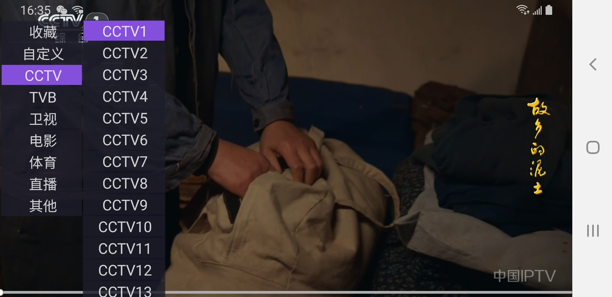
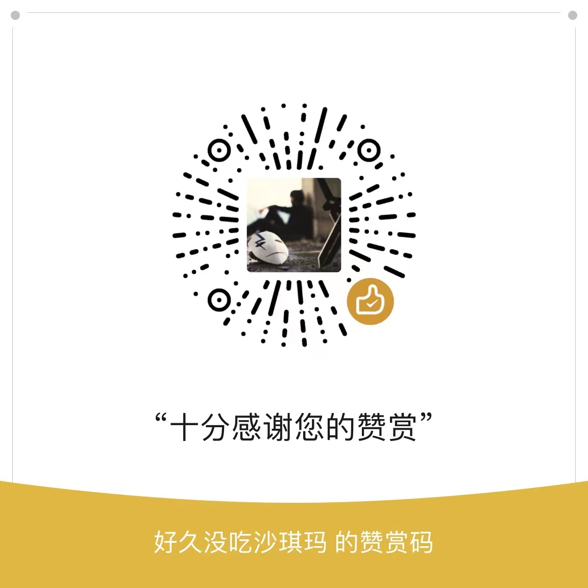

# T_v

## 介绍
本项目仅供学习研究，禁止用于商业用途，请于下载二十四小时内删除。

本项目可能随时终止，请大家谨慎使用，建议使用官方渠道进行观看。

本项目使用的部分代码、图片、文字等资源来源于网络，如有侵权，请联系删除。

## 安装教程
1. 下载
    * TV端 app-release [gitee](https://gitee.com/Csjon/apks/raw/master/app-release.apk)
    * 手机控制端 webtv-release [gitee](https://gitee.com/Csjon/apks/raw/master/webtv-release.apk)
2. 安裝
    * U盘安装
    * 当贝推送安装
    * 小米电视可以使用小米电视助手进行安装
    * 如电视可以启用ADB，也可以通过ADB进行安装
       ```shell
       adb install app-release.apk
       ```

## 使用说明
  能打开就能用,有啥功能自行摸索



## 赞赏
